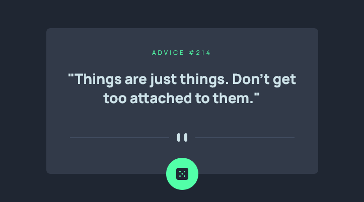

# Frontend Mentor - Advice generator app solution

This is a solution to the [Advice generator app challenge on Frontend Mentor](https://www.frontendmentor.io/challenges/advice-generator-app-QdUG-13db). Frontend Mentor challenges help you improve your coding skills by building realistic projects.

## Table of contents

- [Overview](#overview)
  - [The challenge](#the-challenge)
  - [Screenshot](#screenshot)
  - [Links](#links)
- [My process](#my-process)
  - [Built with](#built-with)
  - [What I learned](#what-i-learned)
- [Author](#author)

## Overview

### The challenge

Users should be able to:

- Fetch data from API
- Display on a cute little card
- Have the circle glow when hovered over (I also made this fetch a new quote)

### Screenshot



### Links

- Solution URL: [Add solution URL here](https://your-solution-url.com)
- Live Site URL: [Add live site URL here](https://your-live-site-url.com)

## My process

### Built with

- Semantic HTML5 markup
- Flexbox
- Mobile-first workflow
- [React](https://reactjs.org/) - JS library
- [Tailwind](https://tailwindcss.com/) - Utility first CSS framework

### What I learned

- I learned a bit about using shadows in CSS.
- I learned how to not store a cache when fetching API data.
  ```
  fetch("https://api.adviceslip.com/advice", { cache: "no-cache" })
  ```

## Author

- Website - [Raymond Zeaiter](https://raymond-zeaiter.au)
- Frontend Mentor - [@king-oldmate](https://www.frontendmentor.io/profile/king-oldmate)
